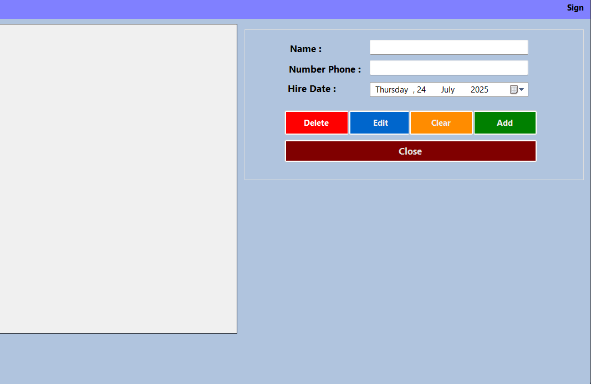
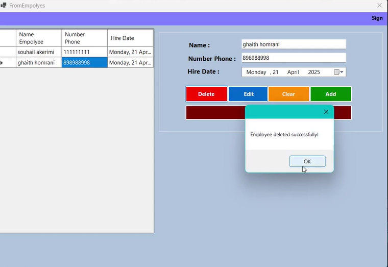

<h1>Employee Manager - C# Windows Forms Application</h1>

<h2>Overview</h2>

Employee Manager is a desktop application built with C# Windows Forms for managing employee records. It provides basic CRUD operations for employee data management.

<h2>Features</h2>
<ul>
<li><strong>Add Employee:</strong> Create new employee records with name, phone, and hire date</li>
<li><strong>Edit Employee:</strong> Modify existing employee information</li>
<li><strong>Delete Employee:</strong> Remove employee records with confirmation dialog</li>
<li><strong>Clear Form:</strong> Reset all input fields</li>
<li><strong>Data Grid:</strong> Display all employees in a sortable table</li>
</ul>

<h2>User Interface</h2>
<h3>Main Components</h3>
<ul>
<li><strong>Employee List:</strong> DataGridView showing Name, Phone Number, Hire Date columns</li>
<li><strong>Input Fields:</strong> Name (TextBox), Number Phone (TextBox), Hire Date (DateTimePicker)</li>
<li><strong>Action Buttons:</strong> Delete (Red), Edit (Blue), Clear (Orange), Add (Green)</li>
</ul>

<h3>Application Window</h3>

The main window "FromEmployees" displays employee records in a grid format with form fields on the right side for data entry and modification.

<h2>How to Use</h2>
<h3>Adding an Employee</h3>
<ol>
<li>Enter employee name</li>
<li>Enter phone number</li>
<li>Select hire date</li>
<li>Click "Add" button</li>
</ol>

<h3>Editing an Employee</h3>
<ol>
<li>Select employee from grid</li>
<li>Modify information in form fields</li>
<li>Click "Edit" button</li>
</ol>

<h3>Deleting an Employee</h3>
<ol>
<li>Select employee from grid</li>
<li>Click "Delete" button</li>
<li>Confirm deletion in dialog box</li>
<li>Success message: "Employee deleted successfully!"</li>
</ol>

<h2>Technical Details</h2>
<h3>Technology Stack</h3>
<ul>
<li>C# Programming Language</li>
<li>Windows Forms Framework</li>
<li>.NET Framework</li>
<li>Visual Studio IDE</li>
</ul>

<h2>Key Functionality</h2>
<ul>
<li>Form validation for required fields</li>
<li>Grid selection and data binding</li>
<li>Date picker for hire date selection</li>
<li>Confirmation dialogs for delete operations</li>
<li>Success/error message notifications</li>
</ul>
